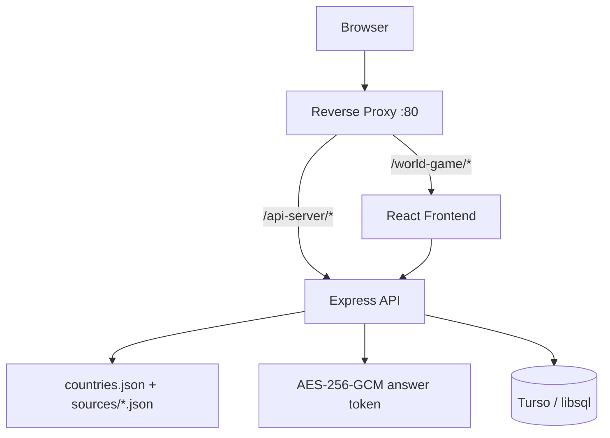

# 🌍 World Game

**Version:** 0.0.0 <br/>
**Date:** July 2026

> A "Who Wants to Be a Millionaire?"-style geography trivia game — climb a 15-level money ladder answering questions about flags, capitals, currencies, continents, languages, national dishes, TLDs, government types, independence years, population density, and religion.

---

## 📋 Table of Contents

<ul>
  <li><a href="#1-introduction">1. Introduction</a>
    <ul>
      <li><a href="#11-purpose">1.1 Purpose</a></li>
      <li><a href="#12-scope">1.2 Scope</a></li>
      <li><a href="#13-intended-audience">1.3 Intended Audience</a></li>
    </ul>
  </li>
  <li><a href="#2-api-reference">2. API Reference</a></li>
  <li><a href="#3-system-architecture">3. System Architecture</a>
    <ul>
      <li><a href="#31-high-level-architecture">3.1 High-Level Architecture</a></li>
      <li><a href="#32-technology-stack">3.2 Technology Stack</a></li>
      <li><a href="#33-folder-structure">3.3 Folder Structure</a></li>
    </ul>
  </li>
  <li><a href="#4-data-design">4. Data Design</a>
    <ul>
      <li><a href="#41-entities">4.1 Entities and Relationships</a></li>
      <li><a href="#42-schema">4.2 Database Schema</a></li>
    </ul>
  </li>
  <li><a href="#5-installation">5. Installation</a></li>
  <li><a href="#6-configuration">6. Configuration</a></li>
  <li><a href="#7-usage">7. Usage</a></li>
  <li><a href="#8-game-mechanics">8. Game Mechanics</a></li>
  <li><a href="#9-security">9. Security</a></li>
  <li><a href="#10-bugs-fixed-and-lessons-learned">10. Bugs Fixed &amp; Lessons Learned</a></li>
  <li><a href="#11-license">11. License</a></li>
</ul>

---

<a id="1-introduction"></a>
## **1. Introduction**

<a id="11-purpose"></a>
### **1.1 Purpose**

World Game is a full-stack trivia application that turns geography knowledge into a "Who Wants to Be a Millionaire?"-style money-ladder game. It pairs a stateless Express API (question generation, answer verification, and a leaderboard) with a React/Vite frontend.

<a id="12-scope"></a>
### **1.2 Scope**

The system allows a player to:

- Enter a name and choose a difficulty (Easy / Medium / Hard).
- Answer up to 15 multiple-choice geography questions drawn from 12 categories: flag, capital, continent, currency, national dish, language, TLD, government type, independence year, national symbol, population density, and religion.
- Climb a money ladder from $100 to $1,000,000, with guaranteed "safe haven" winnings at level 5 ($1,000) and level 10 ($32,000).
- Use a one-time 50/50 lifeline to eliminate two wrong answers.
- Walk away at any time to bank current winnings, or keep playing and risk it all.
- Submit a final score to a public leaderboard, ranked by winnings.

<a id="13-intended-audience"></a>
### **1.3 Intended Audience**

Backend developers, frontend engineers, and technical reviewers evaluating the application's architecture, data design, and question-generation logic.

---

<a id="2-api-reference"></a>
## **2. API Reference**

All routes are served by `api-server` and defined in `lib/api-spec/openapi.yaml` (source of truth), from which Zod schemas and React Query hooks are code-generated via Orval.

### Health — `GET /healthz`

Returns `{ "status": "ok" }`.

### Game — `/game/*`

| Method | Route | Description |
|--------|-------|-------------|
| `GET`  | `/game/question` | Returns a randomly generated question for a given `difficulty` and `level` (1–15), with an encrypted answer token |
| `POST` | `/game/verify` | Checks a selected option index against the token; returns whether it was correct |
| `POST` | `/game/fifty-fifty` | Consumes the 50/50 lifeline for a question token; returns two wrong option indices to eliminate |

#### `GET /game/question?difficulty=easy&level=1`
```json
{
  "id": "…",
  "difficulty": "easy",
  "level": 1,
  "type": "capital",
  "prompt": "What is the capital of France?",
  "flagImage": null,
  "options": ["Paris", "Berlin", "Madrid", "Rome"],
  "token": "<opaque encrypted token>"
}
```

#### `POST /game/verify`
```json
{ "token": "<token from /game/question>", "selectedIndex": 0 }
```

#### `POST /game/fifty-fifty`
```json
{ "token": "<token from /game/question>" }
```

### Leaderboard — `/scores`

| Method | Route | Description |
|--------|-------|-------------|
| `GET`  | `/scores?limit=10` | List the top scores, ordered by winnings descending (limit 1–100, default 10) |
| `POST` | `/scores` | Save a completed game's score |

#### `POST /scores`
```json
{
  "playerName": "Ada",
  "winnings": 32000,
  "difficulty": "medium",
  "questionsAnswered": 10,
  "correctAnswers": 10,
  "won": false
}
```

---

<a id="3-system-architecture"></a>
## **3. System Architecture**

<a id="31-high-level-architecture"></a>
### **3.1 High-Level Architecture**

```
┌─────────────────────────────────────────────────────────────────┐
│                        Reverse Proxy                             │
│           (path-based routing, mTLS, shared port 80)            │
└────────────┬─────────────────────────┬──────────────────────────┘
             │ /api-server/*           │ /world-game/*
      ┌──────▼──────┐          ┌───────▼──────┐
      │  Express API│          │  React/Vite  │
      │   (stateless)│         │   Frontend   │
      └──────┬──────┘          └──────────────┘
             │
     ┌───────┴────────────────┐
     │                        │
┌────▼─────────┐    ┌─────────▼──────────┐
│  Turso        │    │  Local JSON        │
│  (libsql,     │    │  country datasets  │
│  leaderboard) │    │  (in-memory)       │
└───────────────┘    └────────────────────┘
```



<a id="32-technology-stack"></a>
### **3.2 Technology Stack**

| Layer | Technology | Version |
|-------|-----------|---------|
| Runtime | Node.js | 24 |
| Language | TypeScript | 5.9 |
| Monorepo | pnpm workspaces | 10 |
| API Framework | Express | 5 |
| Database | Turso (libsql) + Drizzle ORM | 0.15 client |
| Validation | Zod (`zod/v4`) + `drizzle-zod` | — |
| API Codegen | Orval (OpenAPI → Zod + React Query hooks) | — |
| Logging | pino + pino-http | 9 / 10 |
| Build (API) | esbuild (ESM bundle) | 0.27 |
| Frontend | React + Vite + TanStack Query + Framer Motion | — |
| Routing (FE) | wouter | — |
| UI Components | Radix UI + Tailwind CSS | — |

<a id="33-folder-structure"></a>
### **3.3 Folder Structure**

```
world-game/
├── artifacts/
│   ├── api-server/                    # Express backend
│   │   ├── src/
│   │   │   ├── index.ts               # Bootstrap
│   │   │   ├── app.ts                 # Express app (middleware, routes)
│   │   │   ├── routes/
│   │   │   │   ├── health.ts
│   │   │   │   ├── game.ts            # question / verify / fifty-fifty
│   │   │   │   └── scores.ts          # leaderboard CRUD
│   │   │   ├── lib/
│   │   │   │   ├── countries.ts       # dataset loader/merger + difficulty buckets
│   │   │   │   ├── questions.ts       # question generation per category
│   │   │   │   ├── answerToken.ts     # AES-256-GCM token encrypt/decrypt
│   │   │   │   └── logger.ts
│   │   │   └── data/
│   │   │       ├── countries.json     # merged base dataset (235 countries)
│   │   │       └── sources/*.json     # raw supplementary datasets
│   │   └── build.mjs                  # esbuild config
│   ├── world-game/                    # React/Vite frontend
│   │   └── src/
│   │       ├── pages/                 # start, game, leaderboard screens
│   │       ├── components/ui/         # Radix-based UI primitives
│   │       └── components/            # theme provider/toggle
│   └── mockup-sandbox/                # Canvas component preview server
├── lib/
│   ├── db/                            # Drizzle schema + Turso client
│   ├── api-spec/                      # openapi.yaml (source of truth)
│   ├── api-zod/                       # generated Zod schemas
│   └── api-client-react/              # generated React Query hooks
└── README.md                          # project overview & conventions
```

---

<a id="4-data-design"></a>
## **4. Data Design**

<a id="41-entities"></a>
### **4.1 Entities and Relationships**

- **Country** — name, capital, population, continent, currency, languages, national dish, flag (base64 SVG data URI), TLD, government type, independence year, national symbol, population density, religion. Loaded from `countries.json` and merged at startup with per-category source files in `data/sources/`; any country missing a field for a given category gets `null` rather than a fabricated value, and question generation skips null fields.
- **Question** (ephemeral, not persisted) — difficulty, level, type, prompt, 4 options, optional flag image, and an opaque encrypted `token` carrying the correct answer.
- **Score** (persisted) — one row per completed/abandoned game: player name, winnings, difficulty, questions answered, correct answers, whether the top prize was won, and a timestamp.

<a id="42-schema"></a>
### **4.2 Database Schema**

```sql
CREATE TABLE scores (
  id                 INTEGER PRIMARY KEY AUTOINCREMENT,
  player_name        TEXT NOT NULL,
  winnings           INTEGER NOT NULL,
  difficulty         TEXT NOT NULL CHECK (difficulty IN ('easy','medium','hard')),
  questions_answered INTEGER NOT NULL,
  correct_answers    INTEGER NOT NULL,
  won                INTEGER NOT NULL,   -- boolean
  created_at         INTEGER NOT NULL   -- ms epoch, defaults to now
);
```

Only completed or walked-away games are persisted — in-progress quiz state lives entirely in the encrypted answer token, not in the database (see [Security](#9-security)).

---

<a id="5-installation"></a>
## **5. Installation**

```bash
# install dependencies
pnpm install

# push the leaderboard schema to Turso (dev only)
pnpm --filter @repo/db run push
```

<a id="6-configuration"></a>
## **6. Configuration**

| Variable | Kind | Purpose |
|----------|------|---------|
| `TURSO_DATABASE_URL` | env var | Turso (libsql) database connection URL |
| `TURSO_AUTH_TOKEN` | secret | Turso database auth token |
| `SESSION_SECRET` | secret | Symmetric key used to encrypt/decrypt per-question answer tokens |
| `CLIENT_PORT` | env var | The port number used to run the Vite frontend development server (e.g., 4000) |
| `SERVER_PORT` | env var | The port number used to run the express backend development server (e.g., 3000) |


<a id="7-usage"></a>
## **7. Usage**

```bash
# run the API server (port 5000)
pnpm --filter @repo/api run dev

# run the frontend (Vite dev server)
pnpm --filter @repo/web run dev

# typecheck everything
pnpm run typecheck

# typecheck + build everything
pnpm run build

# regenerate API hooks/schemas after editing lib/api-spec/openapi.yaml
pnpm --filter @repo/api-spec run codegen
```

---

<a id="8-game-mechanics"></a>
## **8. Game Mechanics**

- **Money ladder** — 15 levels from $100 to $1,000,000, with safe havens at level 5 ($1,000) and level 10 ($32,000): a wrong answer drops winnings back to the last safe haven reached.
- **Difficulty tiers by population** — Easy = the 60 most populous countries, Medium = the next 100, Hard = the rest, used as a proxy for "well-known vs. obscure" without hand-curating lists.
- **Timer** — 20/25/30 seconds per question depending on difficulty.
- **Lifelines** — one 50/50 per game, eliminating two incorrect options.
- **Walk away** — bank current winnings at any time instead of continuing.
- **Leaderboard** — client-reported scores, ranked by winnings; see [Security](#9-security) for the tradeoffs of this design.

---

<a id="9-security"></a>
## **9. Security**

- **Stateless, encrypted answer tokens** — instead of persisting quiz sessions server-side, each `/game/question` response embeds an AES-256-GCM-encrypted, 5-minute-expiring token carrying the correct answer. The client returns this token on `/game/verify` and `/game/fifty-fifty` calls. Encryption (not just signing) is required so the correct answer can't be read off the token by the client.
- **No session/auth state** — the game requires no login; the only persisted data is opinionated leaderboard rows, keeping the attack surface small.
- **Known tradeoff — leaderboard scores are client-reported, not server-verified.** Acceptable for a casual, no-auth trivia game, but a leaderboard-tampering vector; hardening it would require a larger session-tracking redesign and has been intentionally deferred.

---

<a id="10-bugs-fixed-and-lessons-learned"></a>
## **10. Bugs Fixed & Lessons Learned**

- **Native-binding externals in esbuild bundles** — `@libsql/client` must be listed as a direct dependency of any package that imports `@repo/db` and gets bundled with esbuild, not just a transitive workspace dependency. esbuild externalizes native-binding packages (like `libsql`), and Node resolves those externals relative to the bundled file's own `node_modules`, not transitive workspace deps. `build.mjs` externalizes `libsql`/`@libsql/*` alongside other native-module packages for the same reason.
- **Dataset joins degrade gracefully** — supplementary country datasets (TLD, government, independence, symbol, density, religion) don't perfectly match the base dataset's country names. Rather than erroring on a mismatch, unmatched countries simply get `null` for that field, and question generation skips any country/category combination with a null answer.
- **Sparse fields excluded from harder difficulty pools** — the "national symbol" category has too few non-null values among less-populous countries to reliably build 4-option multiple choice, so it was removed from the Hard difficulty rotation while remaining available at Easy/Medium.
- **Re-render isolation for animated UI** — a per-second countdown timer re-rendering the whole game screen caused the money-ladder's active-row highlight animation to stutter. Fixed by memoizing the ladder component (keyed only on level/name/difficulty) and driving the highlight's position via measured DOM rects rather than mount/unmount-based shared-layout animation, so it's immune to unrelated parent re-renders.

---

<a id="11-license"></a>
## **11. License**

MIT
