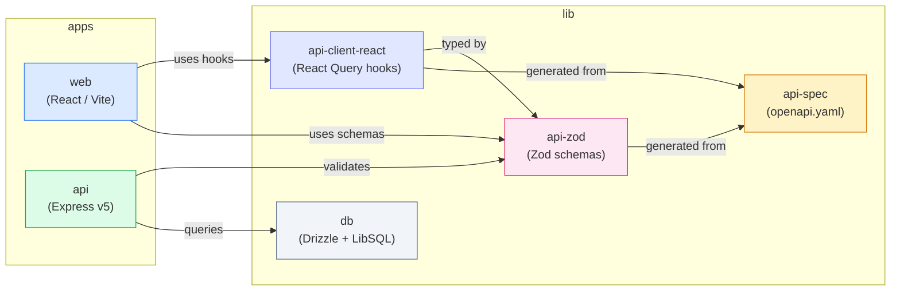
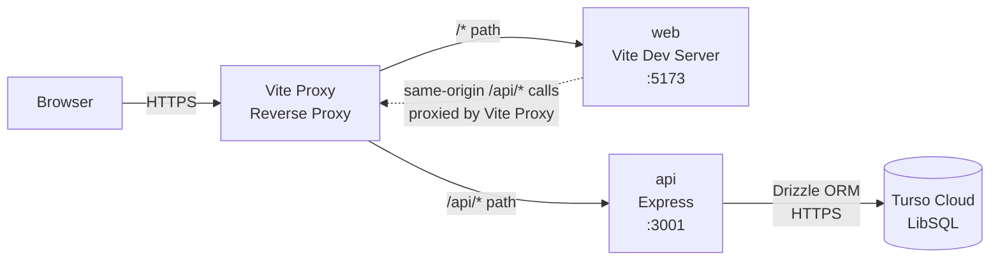
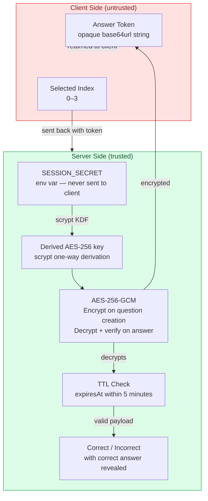

# Architecture Layer Diagram

> **Tool:** Mermaid — paste into [mermaid.live](https://mermaid.live) or any Mermaid-compatible renderer.

## 1. Layered Architecture Overview

```mermaid
graph TB
    subgraph PRESENTATION["🖥️  Presentation Layer  (apps/web)"]
        direction LR
        P1[StartPage<br/>name + difficulty selection]
        P2[GamePage<br/>question, lifelines, money ladder]
        P3[LeaderboardPage<br/>score table + pagination]
        P4[UI Components<br/>shadcn/ui + Tailwind CSS v4]
    end

    subgraph CLIENT_SERVICES["⚙️  Client Service Layer  (@repo/api-client-react)"]
        direction LR
        CS1[React Query Hooks<br/>useGetQuestion<br/>usePostVerify<br/>usePostFiftyFifty<br/>usePostAskAudience<br/>usePostAskExpert]
        CS2[React Query Hooks<br/>useGetScores<br/>usePostScores]
        CS3[customFetch<br/>base URL management<br/>error handling]
    end

    subgraph SHARED_TYPES["📐  Shared Contract Layer  (@repo/api-zod  ·  @repo/api-spec)"]
        direction LR
        ST1[OpenAPI 3.x Spec<br/>openapi.yaml]
        ST2[Zod Schemas<br/>Question, Score, Difficulty<br/>request / response types]
        ST3[Type codegen pipeline<br/>openapi-zod-client]
    end

    subgraph API["🌐  API Layer  (apps/api — Express v5)"]
        direction LR
        A1[Game Router<br/>/api/game/*]
        A2[Scores Router<br/>/api/scores]
        A3[Health Router<br/>/api/health]
        A4[Middleware<br/>cors · express.json · pino-http]
    end

    subgraph DOMAIN["🧠  Domain / Business Logic Layer  (api/src/lib)"]
        direction LR
        D1[questions.ts<br/>generateQuestion<br/>country dataset + shuffling]
        D2[answerToken.ts<br/>AES-256-GCM encrypt/decrypt<br/>createAnswerToken / verifyAnswerToken]
    end

    subgraph DATA["🗄️  Data Layer  (@repo/db)"]
        direction LR
        DA1[Drizzle ORM<br/>type-safe SQL query builder]
        DA2[scores schema<br/>scoresTable definition]
        DA3[LibSQL Client<br/>@libsql/client]
    end

    subgraph INFRA["☁️  Infrastructure Layer"]
        direction LR
        I1[(Turso Cloud<br/>SQLite-compatible<br/>remote DB)]
        I2[Vite Proxy <br/>path-based routing\n/api/* → api\n/* → web]
        I3[SESSION_SECRET<br/>TURSO_DATABASE_URL<br/>TURSO_AUTH_TOKEN<br/>env secrets]
    end

    %% Layer connections
    PRESENTATION -->|React Query hooks| CLIENT_SERVICES
    CLIENT_SERVICES -->|fetch /api/*| API
    SHARED_TYPES -.->|Zod types| CLIENT_SERVICES
    SHARED_TYPES -.->|Zod validation| API
    API -->|calls| DOMAIN
    API -->|queries via| DATA
    DATA -->|TCP / HTTPS| INFRA
    DOMAIN -.->|reads SESSION_SECRET| INFRA

    style PRESENTATION fill:#dbeafe,stroke:#3b82f6,color:#1e3a5f
    style CLIENT_SERVICES fill:#e0e7ff,stroke:#6366f1,color:#312e81
    style SHARED_TYPES fill:#fef3c7,stroke:#d97706,color:#78350f
    style API fill:#dcfce7,stroke:#16a34a,color:#14532d
    style DOMAIN fill:#f0fdf4,stroke:#22c55e,color:#14532d
    style DATA fill:#fce7f3,stroke:#db2777,color:#831843
    style INFRA fill:#f1f5f9,stroke:#64748b,color:#1e293b
```

---

## 2. Monorepo Package Dependency Graph

---

## 3. Request / Response Data Flow

---

## 4. Security Architecture

