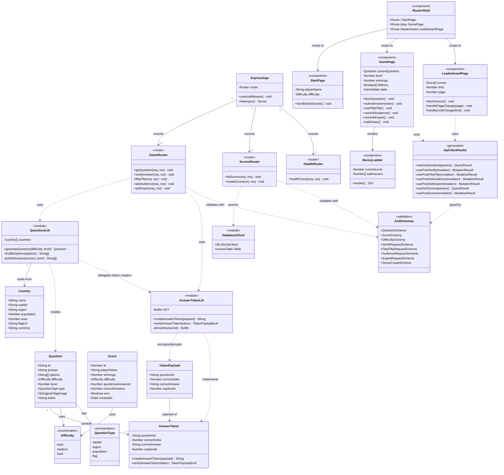

# Class Diagram

> **Tool:** Mermaid — paste into [mermaid.live](https://mermaid.live) or any Mermaid-compatible renderer.

## Full System Class Diagram

---

## Notes

- **Domain objects** (`Question`, `Score`, `AnswerToken`, `Country`) are plain TypeScript types/interfaces, not class instances — represented as classes here for UML clarity.
- **`AnswerTokenLib`** is the only stateful module; it holds the derived AES-256-GCM key in memory (derived once from `SESSION_SECRET` at startup).
- **`ApiClientHooks`** are code-generated from the OpenAPI spec (`packages/api-spec/openapi.yaml`) and should not be edited manually.
- **`ZodSchemas`** are also generated from the OpenAPI spec via `@repo/api-zod` and are shared between the frontend and backend.
