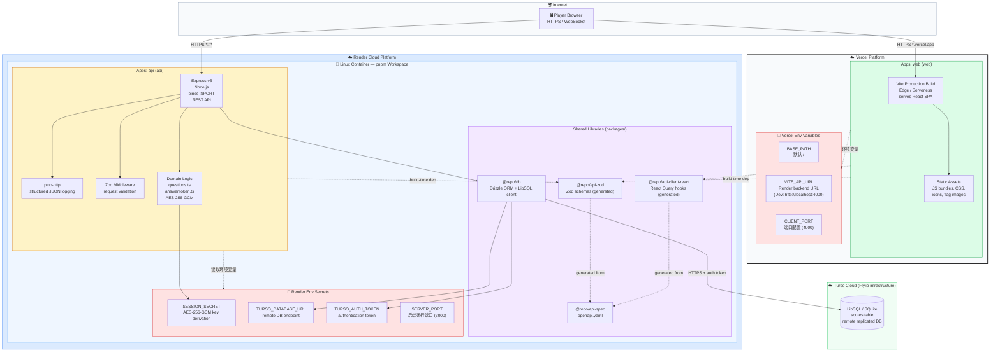
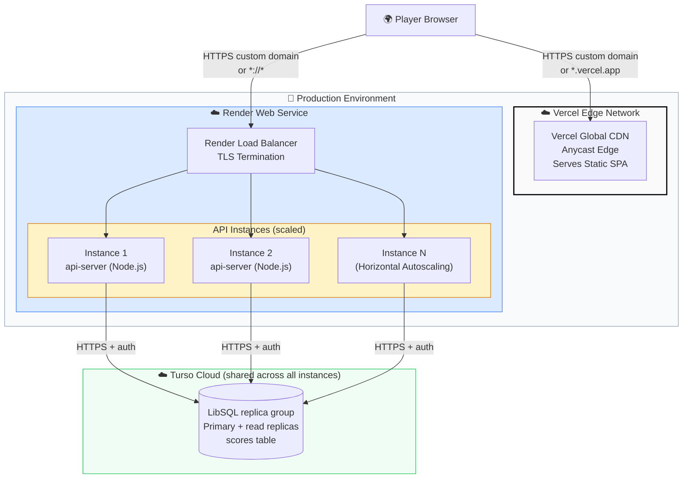
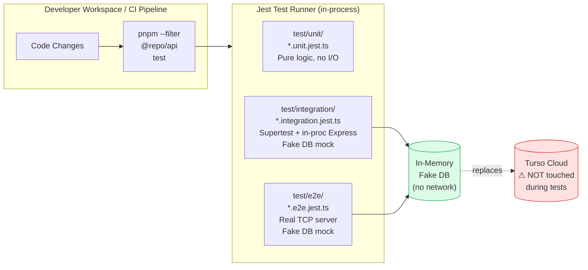

# Deployment Diagram

> **Tool:** Mermaid — paste into [mermaid.live](https://mermaid.live) or any Mermaid-compatible renderer.

## 1. Full Deployment Diagram

---

## 2. Production Deployment (Vercel & Render Scalig)

---

## 3. Development vs. Production Environment Comparison

| Concern | Development (Local Dev) | Production (Vercel + Render Deploy) |
|---------|--------------------------|---------------------------|
| **Frontend** | Vite dev server with HMR | Pre-built static bundle served by Vercel Edge CDN |
| **Backend** | `ts-node` / esbuild-watch | Compiled `dist/index.mjs` running on `Render` |
| **URL** | `localhost:5173 (web)` /  `localhost:3001 (api)` | `*.vercel.app (frontend)` /  `*.onrender.com (backend)` |
| **Database** | Shared Turso DB (same as prod!) | Same Turso DB |
| **Secrets** | Local .env files (BASE_PATH=/, VITE_API_URL=http://localhost:4000,  CLIENT_PORT=4000,  SERVER_PORT=3000) | Vercel & Render Environment Variables |
| **Scaling** | Single local computer | Render Instance Autoscaling & Vercel Global Edge Network |
| **Routing** | Vite local dev proxy (dev) | Separate browser routing paths to respective host domains (prod) |
| **Tests** | Jest, Vitest (unit / integration / e2e) | Not run in prod container |

---

## 4. CI / Test Execution Context

