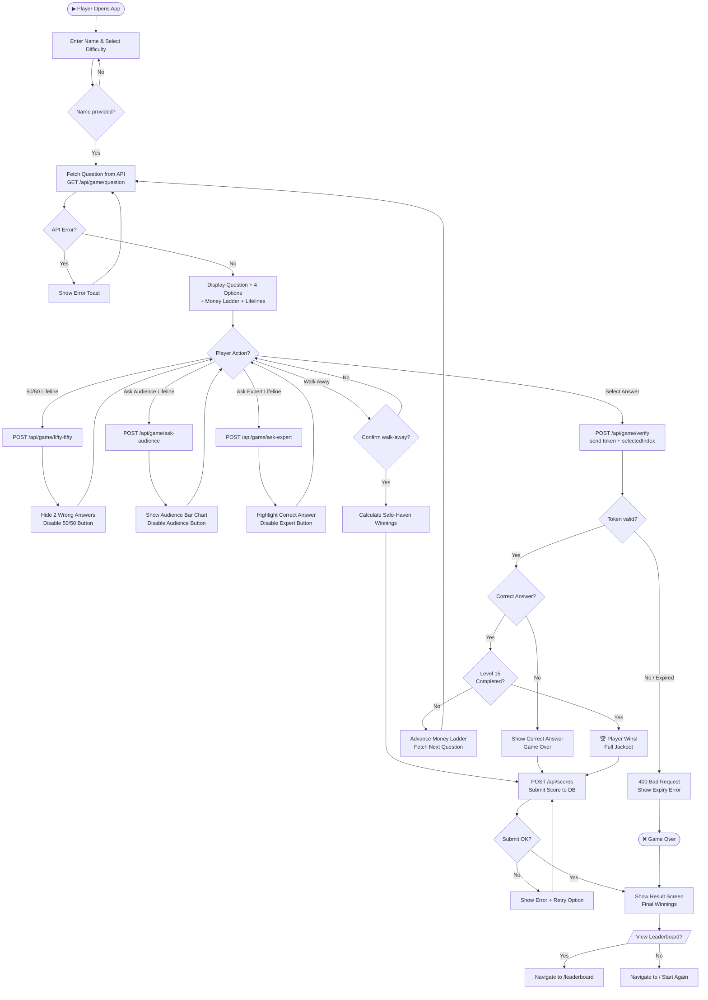
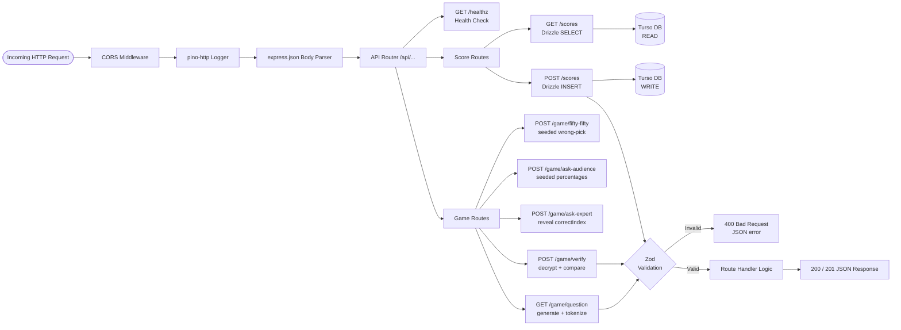
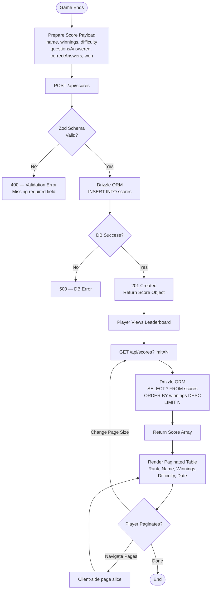
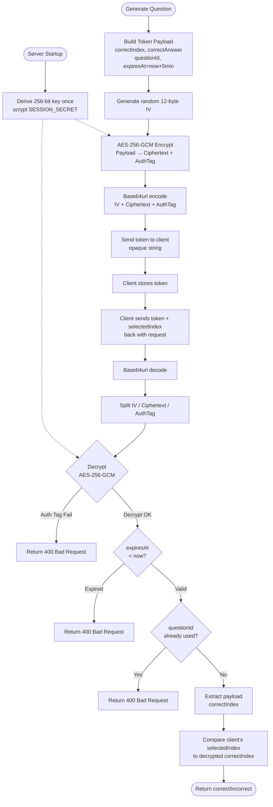

# Process Flow Diagram

> **Tool:** Mermaid — paste into [mermaid.live](https://mermaid.live) or any Mermaid-compatible renderer.

## 1. Game Play Process Flow

---

## 2. API Request Processing Flow

---

## 3. Score Submission & Leaderboard Flow

---

## 4. Answer Token Lifecycle Flow

