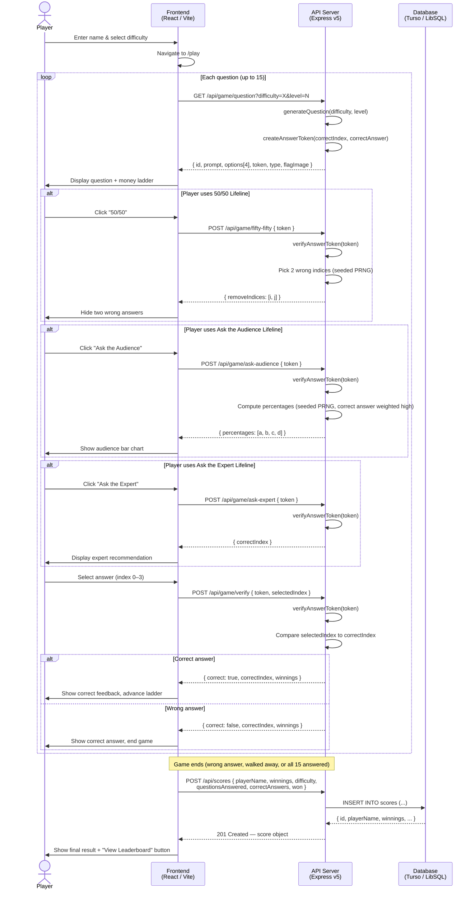
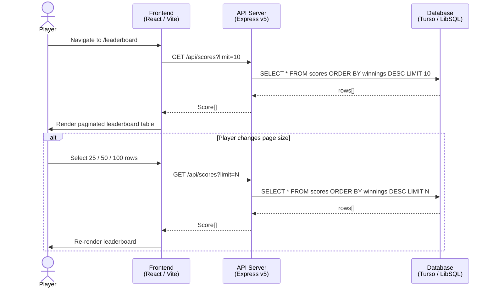

# Sequence Diagram

> **Tool:** Mermaid — paste into [mermaid.live](https://mermaid.live) or any Mermaid-compatible renderer.

## 1. Full Game Play Sequence



---

## 2. Leaderboard Sequence



---

## 3. Answer Token Security Sequence

```mermaid
sequenceDiagram
    participant API as API Server
    participant TOKEN as answerToken.ts<br/>(AES-256-GCM)
    participant CLIENT as Browser / Client

    API->>TOKEN: createAnswerToken({ correctIndex, correctAnswer, questionId })
    TOKEN->>TOKEN: Derive key from SESSION_SECRET (scrypt)
    TOKEN->>TOKEN: Generate random IV (12 bytes)
    TOKEN->>TOKEN: Encrypt payload (AES-256-GCM)
    TOKEN->>TOKEN: Append auth tag (16 bytes)
    TOKEN-->>API: base64url token string
    API-->>CLIENT: token (opaque; answer not readable)

    CLIENT->>API: POST /api/game/verify { token, selectedIndex }
    API->>TOKEN: verifyAnswerToken(token)
    TOKEN->>TOKEN: Decode base64url → IV + ciphertext + tag
    TOKEN->>TOKEN: Decrypt with SESSION_SECRET-derived key
    TOKEN->>TOKEN: Verify auth tag (tamper detection)
    TOKEN->>TOKEN: Check expiresAt (5-minute TTL)

    alt Token valid
        TOKEN-->>API: { correctIndex, correctAnswer, questionId }
        API->>API: Compare selectedIndex to correctIndex
        API-->>CLIENT: { correct: true/false }
    else Token invalid / tampered / expired
        TOKEN-->>API: null
        API-->>CLIENT: 400 Bad Request
    end
```
