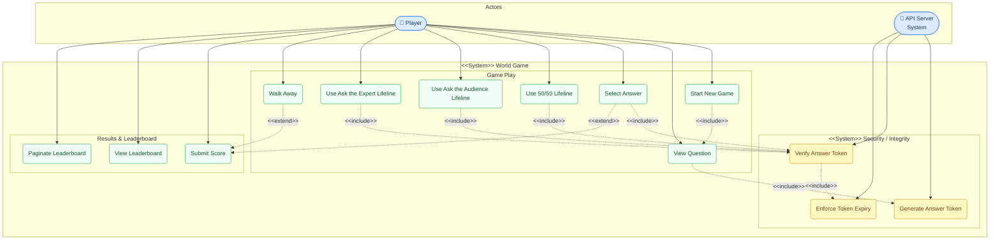

# Use Case Diagram

> **Tool:** Mermaid — paste into [mermaid.live](https://mermaid.live) or any Mermaid-compatible renderer.

## System Use Case Diagram

---

## Actor Descriptions

| Actor | Type | Description |
|-------|------|-------------|
| **Player** | Primary | Human user who plays the game, uses lifelines, and submits their score to the leaderboard |
| **API Server** | System | Express v5 backend; generates questions, verifies answers, enforces lifeline logic, and persists scores |

---

## Use Case Summary

| ID | Use Case | Actor(s) | Priority |
|----|----------|----------|----------|
| UC1 | Start New Game | Player | High |
| UC2 | View Question | Player, System | High |
| UC3 | Select Answer | Player | High |
| UC4 | Use 50/50 Lifeline | Player | Medium |
| UC5 | Use Ask the Audience Lifeline | Player | Medium |
| UC6 | Use Ask the Expert Lifeline | Player | Medium |
| UC7 | Walk Away | Player | Low |
| UC8 | Submit Score | Player, System | High |
| UC9 | View Leaderboard | Player | Medium |
| UC10 | Paginate Leaderboard | Player | Low |
| UC11 | Generate Answer Token | System | High |
| UC12 | Verify Answer Token | System | High |
| UC13 | Enforce Token Expiry | System | High |
